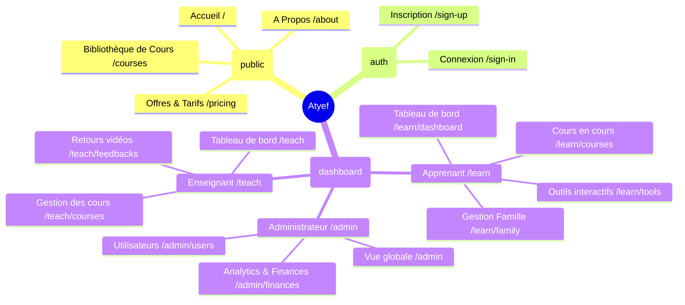
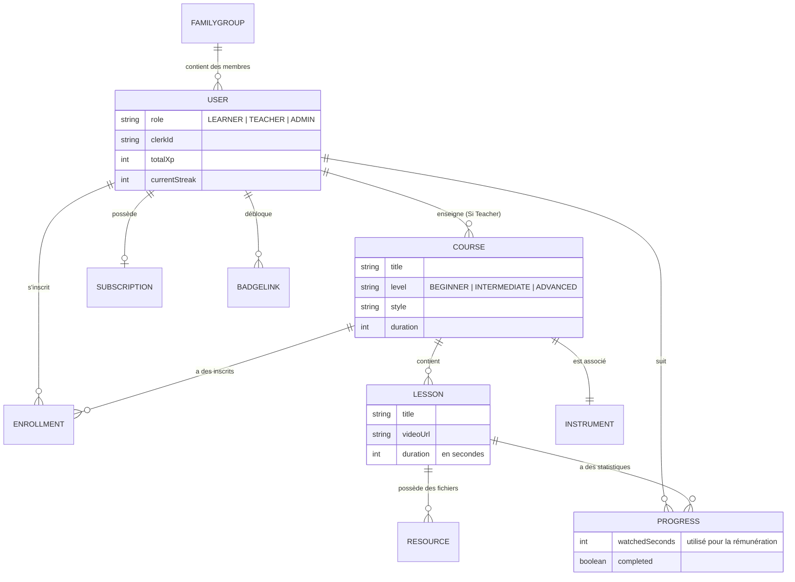
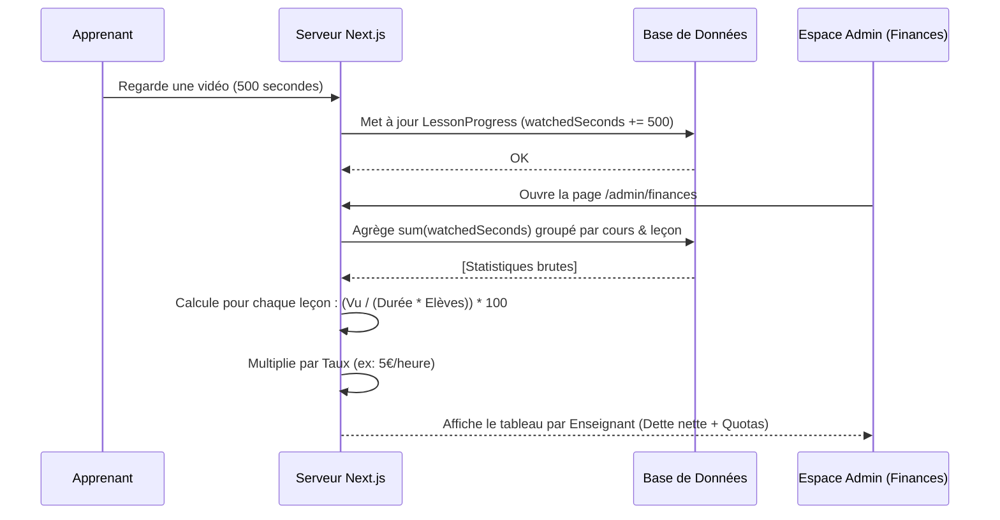
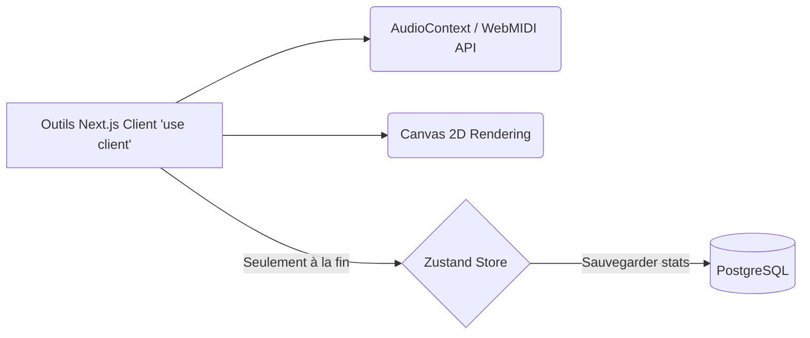

# Architecture de la Plateforme Atyef

Ce document décrit l'architecture technique, la base de données et la structure fonctionnelle de la plateforme d'apprentissage musical **Atyef**.

## 1. Stack Technique Globale

Le projet est construit sur des technologies modernes pour assurer performance, sécurité, et une excellente expérience utilisateur (Cinematic Liquid Glass Design).

```mermaid
graph TD
    Client[Navigateur Web / Mobile] -->|Requêtes HTTP / WebSockets| NextJS[Framework: Next.js 16 App Router]
    
    subgraph Frontend [Couche Présentation (React 19)]
        Tailwind[Tailwind CSS v4 + Oklch]
        Shadcn[Composants Shadcn/UI & Base-UI]
        Framer[Animations Framer Motion]
        Zustand[Gestion d'État Zustand]
    end
    
    subgraph Backend [Couche Backend & API (Node.js/Next.js)]
        ServerActions[Next.js Server Actions]
        PrismaORM[Prisma ORM (v7)]
        Auth[Clerk: Authentification]
        Payments[Stripe: Paiements & Abos]
    end
    
    subgraph Database [Couche Données]
        Postgres[(PostgreSQL)]
    end

    NextJS --> Frontend
    NextJS --> Backend
    Backend --> PrismaORM
    PrismaORM --> Postgres
```

---

## 2. Structure du Routage (App Router)

Atyef sépare intelligemment l'accès entre le public et les trois rôles spécifiques, protégeant ainsi l'accès de chaque espace :



---

## 3. Schéma de Base de Données

Les données sont hautement relationnelles pour faciliter l'affiliation et la gamification.



---

## 4. Logique Métier : Rémunération des Professeurs

L'une des complexités de l'architecture backend est le moteur de calculation instantanée permettant de répartir l'argent selon le temps passé.



---

## 5. Gestion des Outils d'Apprentissage (Interactive)

Tous les outils (Virtual Piano, Guitar Tab, Drum Machine) ne communiquent avec le backend que pour synchroniser la progression ou sauvegarder un exercice. Le traitement musical principal est géré côté "Client" pour qu'il n'y ait aucune latence (0 lag).


